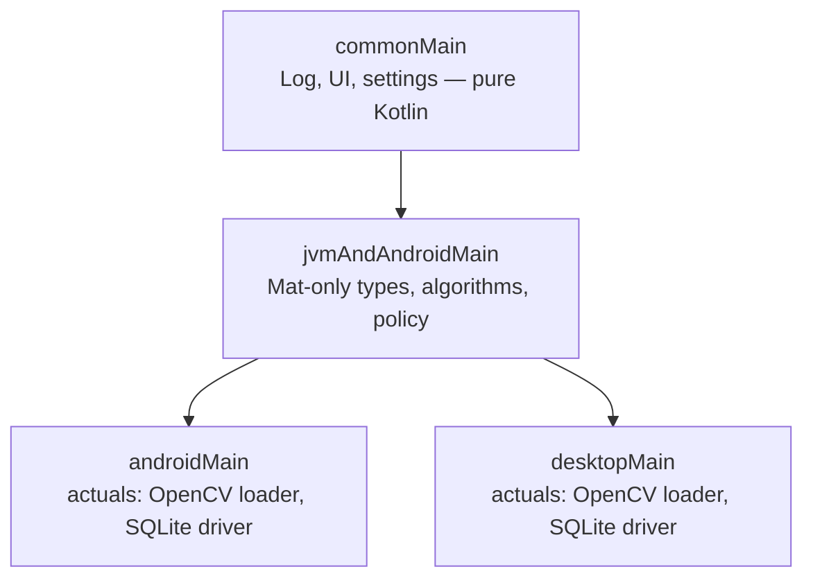
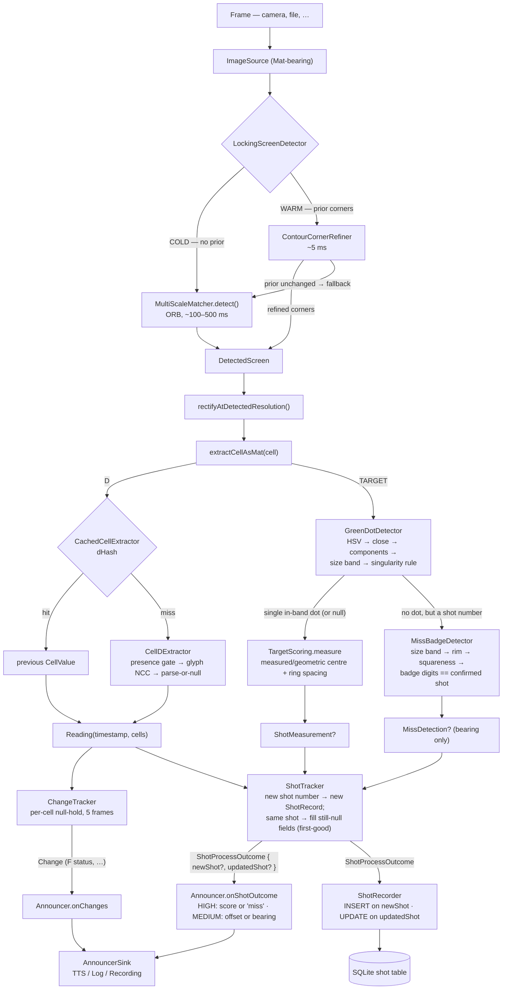

# Architecture

The repo is a Kotlin Multiplatform (Compose) project with three Gradle modules.

## Principles

- **An aid, not the truth.** The app helps a shooter hear their shots;
  it does not adjudicate them. The measured score is promised as
  "probably within a decimal"; uncertainty is surfaced, never invented.
- **The score is geometric; the shot sequence is read.** The
  spoken/recorded score is only ever derived from the green marker's
  measured position. The one symbolic read is the shot number, whose
  parse-or-null semantics is the sequence gate.
- **Refuse rather than guess.** Wrong announcements are worse than
  missed ones. Stages return null on uncertain input; the state machines
  downstream absorb nulls. (The user is blind — a silent glitch is
  recoverable, a confidently wrong score is not.)
- **Abstract on the second implementation, not the first.** Pure
  functions + data classes + the simplest interface that lets a test be
  written.
- **Prove algorithms on still images before devices.** The hard problems
  are vision problems; the desktop harness + annotated corpus is where
  they get solved. See [EXPERIMENTS.md](EXPERIMENTS.md) for the
  approaches that were tried and removed.

```
shared/        — algorithms + types, split by what each platform can compile
desktopApp/    — JVM development harness: labeling GUI, headless CLI for the
                 annotated test corpus, JVM tests for the pipeline
androidApp/    — the product
```

**The desktop app is intentionally a dev harness, not a parallel product.** Algorithms get developed and validated against still images on the JVM (fast iteration, easy debugging, real tests), then migrated to the shared layer when they're ready to ship to Android. So if you see "desktop has this, Android doesn't" that's usually by design — the question is whether the Android side *needs* it yet, not whether desktop has feature-parity to maintain.

## Source-set graph

The split inside `shared/` is the part worth understanding:



Why three layers:

- **`commonMain`** — pure Kotlin, no JVM/Android APIs: the [`Log`](../shared/src/commonMain/kotlin/se/linusborjesson/scorespeaker/Log.kt) gate, the Compose UI system, settings.
- **`jvmAndAndroidMain`** — *both* the desktop JVM and the Android target compile this. Everything that's `Mat`-only goes here. Both platforms get the same `org.opencv.*` API surface (`org.openpnp:opencv` on desktop, `org.opencv:opencv` on Android).
- **`androidMain` / `desktopMain`** — the per-platform `actual` implementations: the OpenCV native loader and the SQLite driver factory (Android also carries its glyph/asset loaders and camera glue in `androidApp`). Desktop-only conveniences (`BufferedImage` ↔ `Mat` bridges, file-based alphabet loaders) live in `desktopApp`, not here — `shared` stays what both platforms need.

`androidApp` and `desktopApp` depend on `shared`.

## What lives where

| Concern | Module / set | Files |
|---|---|---|
| Geometry types | `shared/jvmAndAndroidMain/pipeline/` | `Geometry.kt` (`Point2D`, `Region`, `Quadrilateral`, `CellDefinition`) |
| Perspective transform | `shared/jvmAndAndroidMain/pipeline/` | `CoordinateTransform.kt` (Mat-in/Mat-out homography) |
| OpenCV native loader | `shared/jvmAndAndroidMain/pipeline/OpenCvInit.kt` (expect) + per-target actuals |
| Image source / detection / rectification / cells | `shared/jvmAndAndroidMain/pipeline/` | `ImageSource`, `ScreenDetector` (interface), `LockingScreenDetector` (refine-then-fallback wrapper), `PipelineStages` (`DetectedScreen`, `RectifiedView`, `CellLayout`), `MatcherValidation` |
| `CellExtractor` interface (Mat) | `shared/jvmAndAndroidMain/pipeline/` | `CellExtractor.kt` |
| Cell-level cache | `shared/jvmAndAndroidMain/pipeline/` | `CachedCellExtractor.kt` (dHash; serves the settled value on unchanged frames) |
| Per-frame diff + announcer policy | `shared/jvmAndAndroidMain/pipeline/` | `Reading.kt` (`ChangeTracker` with per-cell null-hold), `Announcer.kt` |
| Instrument UI system (Compose MP) | `shared/commonMain/ui/` | `theme/` (tokens, type, `ScoreSpeakerTheme`); `Primitives` (Eyebrow, Chip, InstrumentCard, StatusDot), `Controls` (Toggle, Segmented, Slider), `TargetDiagram`, `Sparkline` |
| App screens (Compose MP, plain-data) | `shared/commonMain/ui/` | `LiveScreen` (camera injected via a slot) + `LiveScreenState`/`CvOverlay`; `HistoryScreen` + `HistoryUiState`; `SessionDetailScreen` + `SessionDetailUiState`; `SettingsScreen`; `LicensesScreen` (renders the bundled third-party notices). Harness previews: `ThemeGallery`, `*Preview` |
| Session detection + history read model | `shared/jvmAndAndroidMain/pipeline/ShotHistory.kt` | `deriveSessions` (boundary = shot-number reset or inactivity gap), `Session` (count/total/avg/best/missingShotNumbers), `summarize`/`averageSince`, `ShotHistory` (reads the DB) |
| Settings model | `shared/commonMain/settings/AppSettings.kt` | `AppSettings`, `Verbosity`, `OffsetStyle`, `AppLanguage`, `BindableAction` |
| Per-shot state machine | `shared/jvmAndAndroidMain/pipeline/` | `ShotTracker.kt` (`ShotRecord`, `ShotProcessOutcome`) — confirms the shot number, accumulates the measurement, first-good policy |
| Persistent shot history | `shared/jvmAndAndroidMain/pipeline/` + `shared/commonMain/sqldelight/` | `ShotRecorder.kt` writes `ShotProcessOutcome` into a SQLDelight-backed `shot` table; per-platform `DriverFactory` actuals |
| Typed cell values | `shared/jvmAndAndroidMain/cells/CellValues.kt` | sealed `CellValue` + `ScoreShotValue`, `TextValue`, `ScoreValue` |
| Detection pipeline (ORB, RANSAC, contour refine) | `shared/jvmAndAndroidMain/processing/` | `OrbTemplateMatcher`, `MultiScaleMatcher`, `ContourCornerRefiner` |
| Green-shot-dot stack | `shared/jvmAndAndroidMain/processing/` | `GreenDotDetector` (HSV + connected components + size-band + singularity), `TargetGeometryEstimator`, `TargetScoring` (measured centre/ring-spacing, `geometricTargetCenter` fallback; dot centroid → `ShotMeasurement`) |
| Off-target shots | `shared/jvmAndAndroidMain/processing/` | `MissBadgeDetector` (edge badge: size band + rim + squareness + glyph-confirmed shot number → `MissDetection`, a bearing with no ring offset) |
| The glyph reader (Mat-first, engine-free) | `shared/jvmAndAndroidMain/ocr/` | `CellDExtractor`, `DigitTemplateMatcher` |
| SQLite driver factories | `shared/{androidMain,desktopMain}/.../db/DriverFactory.*.kt` | Android: `AndroidSqliteDriver` against app-private `scorespeaker.db`; Desktop: `JdbcSqliteDriver`, in-memory by default |
| `BufferedImage` glue (image I/O, AWT bridges) | `desktopApp/.../pipeline/` | `Pipeline.kt` (`fromBufferedImage`), `ImageBridge.kt`, `PipelineStagesDesktop.kt` (`extractCell` extension) |
| Asset-side helpers (templates from APK) | `androidApp/.../processing/` | `MultiScaleMatcherAssets.kt`, `DigitTemplateMatcherAssets.kt` |
| TTS sink | `androidApp/announcer/TtsAnnouncerSink.kt` | HIGH → `QUEUE_FLUSH` (score interrupts old utterances), MEDIUM/LOW → `QUEUE_ADD` (offset queues behind the score) |
| Android entry point | `androidApp/MainActivity.kt` | wires dependencies (detector, extractors, tracker, shot tracker, shot recorder, announcer); builds a single `LiveUiState` snapshot; hosts the Compose tree |
| Camera loop (analyzer thread) | `androidApp/FrameAnalyzer.kt` | one `ImageAnalysis.Analyzer`: detect → rectify → extract D + run green-dot on TARGET → feed `ChangeTracker` + `ShotTracker` → emit `FrameResult` |
| Live screen (Android wrapper) | `androidApp/CameraScreen.kt` + `LiveUiState.kt` | thin wrapper over the shared `LiveScreen`: maps `LiveUiState` → `LiveScreenState`, injects a CameraX `PreviewView` as the camera slot |
| App shell / navigation | `androidApp/AppRoot.kt` | live screen is home; HISTORY/SETTINGS chips push overlays with a BACK chip + system-back; History reads the DB on open and routes to Session detail |
| History UI-state builder | `androidApp/HistoryFormatter.kt` | `Session` → `HistoryUiState` / `SessionDetailUiState`, formatting dates (`SimpleDateFormat`) and offset notes |
| Settings persistence | `androidApp/SettingsStore.kt` | `AppSettings` ↔ SharedPreferences; `MainActivity.applySettings` mutates the live `AnnouncerPolicy` + TTS rate |
| Test-case capture writer | `androidApp/Capture.kt` | one zip per capture under `captures/<date>/`, holding `source.png` + `metadata.json` + `capture-debug.json` + `rectified.png` + `crops/D.png` — the directory shape the desktop tools consume once unzipped |
| Bundled test assets | `desktopApp/test-data/` | `masked-template.png` (detection template) + `glyphs/shot-font/` (the real-glyph alphabet). Annotated cases are *not* here — they live in the external corpus, see [Test data](#test-data) |

`shared/desktopMain` holds only the two `actual`s (OpenCV loader, SQLite driver); the `BufferedImage` / AWT / file-loader glue lives in `desktopApp` with its only consumer. All algorithmic code is in `jvmAndAndroidMain` and compiles for both targets — both platforms get the same `org.opencv.*` API surface (`org.openpnp:opencv` on desktop, `org.opencv:opencv` on Android).

## Pipeline flow (per frame)



Android runs this sequence inline in `FrameAnalyzer.analyze()` — the canonical orchestration; desktop's `TestDataProcessor` composes the same stages for the headless corpus runs. Running it inline lets the analyser keep the source `Mat` alive across the detection + extraction + capture-write window, and lets the Compose overlay read the latest detected quad directly.

## Key types you'll touch

- **`CoordinateTransform`** — perspective homography between a source quadrilateral and a target rectangle. Mat-in, Mat-out. `AutoCloseable` because it owns OpenCV Mats.
- **`ScreenDetector` (`interface`)** — `detect(ImageSource) -> DetectedScreen?` plus template-loading. `MultiScaleMatcher` is the only production implementation today.
- **`LockingScreenDetector`** — wraps any `ScreenDetector` with a cold/warm state machine. Warm-frame `detect()` runs `ContourCornerRefiner.refineCorners(priorCorners)` (~5 ms); falls through to the inner detector on refinement failure. Single-thread; expose `reset()` for manual recalibration. Production Android uses this wrapper.
- **`CellExtractor` (`fun interface`)** — `(Mat) -> CellValue?`. Implement once per cell type per platform (or share if Mat-only).
- **`CachedCellExtractor`** — decorator that dHashes the input Mat and returns the previous `CellValue` when consecutive frames are visually identical. On unchanged frames the trackers see one settled value instead of a per-frame re-read.
- **`ChangeTracker`** — sees one `Reading` at a time, emits `Change` events per cell using `CellValue.matches()`. A per-cell `null` is treated as "no new information" — the last known good value is held across `nullHoldThreshold` consecutive nulls (default 5 ≈ 0.3–0.5 s at 10–15 fps), so a single read glitch doesn’t produce a spurious "cell disappeared" → "cell reappeared" pair.
- **`ShotTracker`** — sits above the per-cell stream, keyed by `ScoreShotValue.shot`. A new shot number starts a fresh `ShotRecord`; subsequent frames for the same shot fill in still-null fields (the `measurement`, or the `miss`) under a first-good policy. `process(reading, measurement?, miss?)` returns a `ShotProcessOutcome { newShot, updatedShot }` — the `newShot` outcome is the canonical "react once per shot" trigger.
- **`ShotRecorder`** — writes `ShotProcessOutcome` into a SQLDelight `shot` table. INSERT on `newShot`, UPDATE on `updatedShot`. In-memory database for tests; app-private `scorespeaker.db` on Android.
- **`DriverFactory`** — `expect` class with per-platform `actual`s. Android constructor takes a `Context`; desktop constructor takes an optional file path (null = in-memory).
- **`Announcer`** — two entry points: `onChanges(changes)` formats per-cell announcements (Cell F status etc.); `onShotOutcome(outcome)` emits the HIGH-priority score and MEDIUM-priority offset utterances on `newShot` (for an off-target shot: the word "miss" instead of a score, and the badge's bearing instead of an offset). Cell D's per-cell announcement is suppressed by `AnnouncerPolicy` — score is `ShotTracker`-driven so re-acquisition after a detection gap stays silent. Decimals are written out as "point" so TTS pronounces them correctly.
- **`AnnouncerSink` (`fun interface`)** — `Announcement -> Unit`. `TtsAnnouncerSink` on Android (HIGH = `QUEUE_FLUSH`, MEDIUM = `QUEUE_ADD` so the offset queues behind the score), `RecordingAnnouncerSink` for tests.
- **`GreenDotDetector`** — finds the SIUS "latest shot" green marker inside the rectified TARGET cell. `candidates(mat)` returns every in-band blob; `detect(mat)` applies the singularity rule (single in-band candidate or null). See [PIPELINE.md](PIPELINE.md) §6 for the algorithm.
- **`TargetScoring`** — converts a detected dot into a `ShotMeasurement(score, offsetXRings, offsetYRings, distanceRings)`: measured centre + ring spacing from `TargetGeometryEstimator` when the black aiming area is visible, else the `geometricTargetCenter` fallback + the corpus-fitted `ringSpacingRatio`. This *is* the product score; the offsets drive the "down 3, left 1" feedback.
- **`MissBadgeDetector`** — a shot the display placed *off* the target face isn't drawn on the face; the SIUS draws a small green badge at the cell rim, carrying the shot number, pointing the way the shot went out. Detected positively (size band → rim → squareness → the badge's own digits must equal the confirmed shot number), never inferred from the marker's absence. Returns a `MissDetection` holding a *bearing only* — deliberately not a `ShotMeasurement`, so a rim position can never leak into the group average. See [PIPELINE.md](PIPELINE.md) §6.

## Test data

- **Bundled assets** (`desktopApp/test-data/`) — the magenta-masked
  detection template and the real-glyph alphabet. The alphabet is
  harvested from the corpus by `GlyphAlphabetTools` and **duplicated into
  `androidApp/src/main/assets/glyphs/`** — the harvest writes only the
  desktop copy, so the product's copy has to be synced deliberately.
- **The capture corpus** — annotated range photos, one directory per
  case (`source.png` + `metadata.json` + `annotations.json`, with
  `output/` regenerated per run). Range photos are private, so the
  corpus lives outside the repo at `$SCORE_SPEAKER_CORPUS` (default
  `~/score-speaker-corpus`); corpus tests skip when it is absent and run
  in full when present.

New cases come from the Android **Capture** button — it writes the same directory shape (minus `annotations.json`, which the desktop labeling GUI adds).
