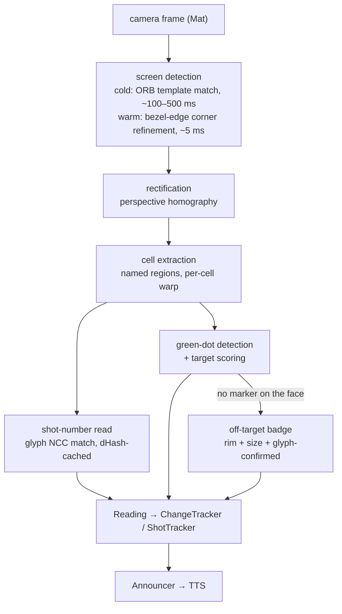

# The processing pipeline — algorithms and rationale

This document walks the vision pipeline end to end and explains not just
*how* each stage works but *why* it is shaped the way it is. It complements
[ARCHITECTURE.md](ARCHITECTURE.md) (module layout, principles, what lives
where) and [EXPERIMENTS.md](EXPERIMENTS.md) (approaches that were tried
and removed).

The problem being solved: a phone on a tripod points its rear camera at a SIUS
electronic-target display at a shooting range. The app must continuously
watch the display — the shot number (glyph-matched from Cell D) and the
"latest shot" marker on the target graphic, from which score and aim offset
are *measured* geometrically — and speak each new shot aloud. The end user is
blind, which sets the two constraints everything below serves:

- **Wrong announcements are worse than missed ones.** Several stages refuse
  (return null) instead of guessing; downstream state machines absorb nulls.
- **It has to run continuously on a phone.** Frames arrive at 10–30 fps; full
  detection is far too slow to run on every frame, so the pipeline is built
  around *frame-to-frame coherence*: the display barely moves and its
  content changes maybe once per 30 s.



## 0. Platform choices

### Why Kotlin Multiplatform

The product is an Android app, but the hard problems — detection accuracy,
reading correctness, change-detection policy — are computer-vision problems,
not Android problems. The fastest loop for that kind of work is JVM-side: run the
pipeline on still images, in unit tests, with a debugger, in seconds — no
device, no APK install, no camera. Kotlin Multiplatform lets the *same
compiled code* serve both: algorithms live in a `jvmAndAndroidMain` source set
that both the desktop JVM target and the Android target compile.

Two things make this work in practice:

- **OpenCV has an identical Java API on both platforms.** `org.openpnp:opencv`
  (desktop) and `org.opencv:opencv` (Android) expose the same `org.opencv.*`
  classes; only native-library loading differs, hidden behind one
  `expect`/`actual` function (`OpenCvInit`). The whole pipeline is
  platform-blind.
- **There is no OCR engine.** The one symbolic read left (the shot number)
  is NCC template matching against a real-glyph alphabet — deterministic,
  closed-world, and identical on both platforms; only the alphabet *loader*
  differs (Android assets vs. desktop files). The engines that were tried
  and removed are recorded in [EXPERIMENTS.md](EXPERIMENTS.md).

See [ARCHITECTURE.md](ARCHITECTURE.md) for why the `jvmAndAndroidMain`
intermediate source set exists instead of pure `commonMain`.

### Why Compose Multiplatform

Once the algorithm work lives on the JVM, the desktop harness needs a GUI: a
labeling tool to annotate test photos (drag display corners, enter expected
cell values) and debug views to see *why* a frame failed (candidate overlays,
mask visualizations). Compose Multiplatform means that GUI, the Android app's
UI, and the shared "instrument" design system (`shared/commonMain/ui/`) are
all one toolkit and one language. UI components are written once, previewed on
desktop with plain-data preview states, and shipped on Android unchanged. The
alternative — Swing/JavaFX for the harness, Compose for the app — would have
meant two UI stacks for one person to maintain.

The desktop app is deliberately **a development harness, not a parallel
product** — see [ARCHITECTURE.md](ARCHITECTURE.md).

### Why `Mat` everywhere

Every pipeline stage takes and returns `org.opencv.core.Mat`. Platform image
types (`BufferedImage`, `Bitmap`) appear only at the boundaries (camera in,
UI/debug out). The first refactor pass
measured why this matters: round-tripping through `BufferedImage` and PNG
bytes at each stage boundary cost ~5.4 s per 8K frame; holding a single `Mat`
end to end dropped it to ~180 ms (~40×). Mats are native memory, so ownership
is explicit: "caller owns the returned Mat" contracts, `AutoCloseable`
wrappers, and `useMat { }` helpers throughout.

Two OpenCV gotchas worth knowing when touching pipeline code:

- **Release every Mat.** GC eventually collects them, but Android can OOM
  on native heap first. Use `useMat { }` or `try/finally` + `release()`.
- **`Mat(parent, Rect)` silently collapses to an empty Mat** when the
  rect is degenerate (negative dims, origin past the parent's extent) —
  the crash then surfaces in the *next* operation. Clamp origins with
  `coerceIn`, dims with `coerceAtLeast(0)`, and bail on zero dims before
  constructing the ROI. `ContourCornerRefinerTest` pins both bad shapes.

## 1. Finding the display: ORB template matching

**File:** `shared/src/jvmAndAndroidMain/.../processing/OrbTemplateMatcher.kt`

The first job on a cold frame is: where is the SIUS display, and where are its
four corners? The approach is *feature-based template matching* against a
reference photo of the display.

### Why template matching rather than rectangle detection

The obvious alternative — find bright quadrilaterals via contours or Hough
lines — fails in practice at a shooting range: the scene is full of competing
rectangles (other lanes' displays, paper, windows), the display's border may
be partially occluded or washed out by glare, and a rectangle detector gives
no confidence signal that *this* rectangle is a SIUS display. Matching against
a known template solves identification and localization in one step: if
enough distinctive visual features of the SIUS layout are found in
geometrically consistent positions, that *is* the display, and the geometry of
the match gives the corners.

The template is a photo of the display with its **dynamic regions painted
magenta** — score digits, clock, shot-specific content. Magenta pixels are
masked out of feature extraction (`loadTemplate`), so the matcher only learns
features from the parts of the display that look the same on every frame
(labels, layout chrome, the target graphic's frame). Without this, features
detected on the template's particular score digits would actively mismatch
against a live frame showing different digits.

### How the match works

1. **ORB features** are extracted from template and frame. ORB = FAST corner
   detection + BRIEF binary descriptors with orientation compensation. It's
   chosen over SIFT-style float descriptors because it is fast enough for a
   phone, its binary descriptors match via cheap Hamming distance, and the
   scene (a high-contrast display full of text and lines) produces strong
   corners — ORB's weak spot (low-texture scenes) doesn't apply. Capped at
   500 features per image.
2. **Brute-force matching** with Hamming distance and cross-check (a match
   must be mutual best in both directions), then the best 50 matches by
   descriptor distance are kept.
3. **RANSAC homography** (`Calib3d.findHomography`, reprojection tolerance a
   few px) fits the perspective transform template→frame while rejecting
   outlier matches. A homography is the mathematically correct model here: the
   display is a plane, and a plane photographed from any viewpoint maps to the
   image by exactly a homography. Requiring **≥ 8 RANSAC inliers** (of ≥ 4
   minimum matches) is the confidence gate — random false matches essentially
   never produce 8 geometrically consistent correspondences.
4. The template's four corners are pushed through the homography to get the
   display corners in frame coordinates.

### Multi-scale wrapper

**File:** `processing/MultiScaleMatcher.kt`

ORB's scale invariance (an image pyramid inside the detector) covers moderate
scale differences, but the display's apparent size varies a lot — a phone at
arm's length vs. an 8K corpus photo. So the template is pre-scaled to several
sizes (0.3×, 0.5×, 0.7×, 1.0×) with features pre-computed per scale, and the
frame is matched against each. Two things keep this cheap:

- **Frame features are extracted once** and reused across all template scales
  (extraction, not matching, is the expensive half).
- **The winning scale is sticky.** Consecutive frames have the same display
  size, so the last successful scale is tried first, and if it succeeds
  strongly (inliers ≥ 2× the minimum) the remaining scales are skipped
  entirely. On a live stream this makes the multi-scale search cost the same
  as single-scale after the first frame.

Ties between scales resolve to the higher inlier count; the search order
prefers larger scales (more detail in the template → more reliable match).

## 2. Corner refinement: sub-pixel bezel-edge scan

**File:** `processing/ContourCornerRefiner.kt`

ORB corners are good to roughly ±6 px — fine for "found the display", not fine
for cell extraction, because cell regions are defined as *ratios* of the
rectified display and a few pixels of corner error shifts every cell. The
refiner sharpens the corners using a physical invariant of the hardware: **the
display sits in a black plastic bezel**, so along any line crossing the
display edge from outside, there is always a dark(bezel) → bright(display
frame/content) transition.

The algorithm, per edge of the initial quadrilateral:

1. **Shoot 11 rays perpendicular to the edge**, spread across 8–92% of its
   length, each starting *outside* the display (15% of the corner-to-center
   distance beyond the edge estimate) and scanning *inward*. Perpendicular
   rays — rather than rays radiating from the quad center — stay
   well-conditioned near the edge's ends, which lets the spread be wide and
   gives the later line fit a long lever arm.
2. **Sample an intensity profile** along each ray with bilinear interpolation
   over a bulk-copied grayscale buffer (one JNI copy per refinement call
   instead of one `Mat.get` per pixel — this is what makes the whole
   refinement ~5 ms), then 3-tap smooth it.
3. **Adaptive hysteresis thresholds.** The "dark" and "bright" levels are
   fractions (0.2 / 0.4) of *that ray's own* intensity range, not absolute
   values — so the scan works identically on dim and bright exposures. The
   bright level is deliberately low because the display's outer frame line is
   often much dimmer than interior content; a high threshold would skip past
   the frame line into the interior. A ray whose total contrast is below 40
   gray levels is discarded as untrustworthy.
4. **Find the transition**: walking inward, the profile must first be dark
   (bezel) and then rise above the bright level. Transitions that land too far
   *inside* the prior edge estimate (> 15% of the distance to center) are
   rejected — they are interior content, not the border.
5. **Sub-pixel localization**: the coarse crossing is refined to the position
   of maximum gradient, then interpolated parabolically over neighboring
   gradient values — edge positions come out with sub-pixel precision.
6. **RANSAC line fit per edge.** Individual rays still occasionally latch onto
   glare or a table rule inside the display. All point pairs are tried as
   candidate lines; points within 2.5 px perpendicular distance are inliers;
   at least 3 inliers are required. When several comparably strong consensus
   lines exist (the border *and* a parallel run of interior content), the
   **outermost** qualifying line wins — the display border is by definition
   the outermost transition consistent across rays.
7. The four consensus lines are intersected to produce the refined corners,
   then validated: area within 0.5–1.5× of the initial quad, each corner in
   its expected quadrant. On any failure the refiner returns the *initial
   corners unchanged* — a deliberate contract (see lock-on below).

A white-contour HSV fallback (find the white display face as a blob, fit a
quadrilateral) exists for frames where the gradient method fails entirely.

## 3. Lock-on: refine the prior, fall back to full detect

**File:** `pipeline/LockingScreenDetector.kt`

Full ORB detection costs 100–500 ms on a phone; the refiner costs ~5 ms. Since
the display barely moves between adjacent frames (hand-shake, tripod
vibration), the previous frame's corners are a near-perfect prior.
`LockingScreenDetector` wraps any detector with a two-state machine:

- **COLD** — no prior: run full detection; on success store the corners and go
  WARM.
- **WARM** — run the corner refiner against the prior corners. The refiner's
  "returns the initial corners *reference* unchanged on failure" contract is
  the signal: a new list means it locked on (stay WARM, ~5 ms), the same
  reference means the display moved beyond the ~±15% search band or vanished
  (fall back to full detection; failure there returns to COLD).

The alternative — detect once and lock forever — was rejected because a hard
lock drifts onto stale corners if the phone moves, and detecting *that*
requires heuristics. Refining every frame gives a fresh sanity check for free
and auto-recovers: steady state costs ~5 ms of detection, and a re-aim costs
one full detection cycle.

## 4. Rectification and the cell layout

**Files:** `pipeline/CoordinateTransform.kt`, `pipeline/PipelineStages.kt`

The four corners define a homography from the skewed quadrilateral in the
frame to an upright rectangle. Two design points:

- **Cells are ratios, not pixels.** `CellLayout.siusDisplayCells()` defines
  each named region (A–H, TARGET) as fractions of the rectified screen. The
  same layout therefore works at every resolution — an 8K corpus photo and a
  1080p phone frame extract the same cells.
- **Cells are warped directly from the source.** `extractRegionAsMat` composes
  "rectify" and "crop" into a single `warpPerspective` of just the requested
  region from the *original* frame — the full rectified image is only
  materialized lazily if something actually needs it (debug views). One warp
  instead of warp-then-crop means one resampling pass, less memory traffic,
  and no second interpolation loss.

The `TARGET` cell (the rings graphic, left ~74% of the display) exists
specifically to serve green-dot detection: cropping *before* color
thresholding eliminates the display's competing greens (status LED, green
score text) so the detector's gates can stay simple.

## 5. Reading cells

### The cache in front of the reader: dHash

**File:** `pipeline/CachedCellExtractor.kt`

On a live stream the display content changes about once per shot (~30 s) while
frames arrive at 10–30 fps — over 99% of frames would re-read the same pixels
to the same answer. The reader is wrapped in a decorator that computes a
**64-bit difference hash** of the cell image: downsample to 9×8 grayscale,
emit one bit per horizontal neighbor pair ("left darker than right"). If the
Hamming distance to the previous frame's hash is ≤ 5, return the previous
value without re-reading.

Why dHash specifically: the 9×8 downsample averages out sensor noise, and
comparing *neighbor differences* rather than absolute intensities makes the
hash invariant to global brightness changes (clouds, auto-exposure). Real
content changes are far outside the tolerance — "7.6" vs "8.6" flips ~25 of 64
bits.

The cache earns its place as a *stability* property, not a speed one (a
glyph-match miss costs only ~0.6 ms): serving one settled value across
hundreds of noisy frames means the trackers see a constant, not a
re-derived answer that could flicker on sensor noise.

### Cell D (shot number): gated, glyph-matched, parse-or-null

**File:** `ocr/CellDExtractor.kt`

Cell D shows e.g. `1P 7.6` — a small white shot index and a large green
LED-style score. The shot index is the *sequence gate* (a new shot number
is what starts a shot); the score digits are never read at all — the
product score comes from the green marker. The reader embodies the
"refuse rather than guess" rule:

1. **Presence gate first.** The score digits are always lit bright green
   when a shot is displayed, so the score region's *green dominance*
   (mean G − max(R,B) ≥ 40 over bright pixels) is a cheap "is anything on
   the display?" check — genuine LED digits measure ~130–150, sensor noise
   and white content near zero. Between shots the cell really is empty;
   this gate is what keeps the pipeline silent then.
2. **Reduce the shot region:** per-pixel min(R,G,B) keeps the white shot
   digits bright while green score glyphs bleeding into the crop collapse
   to their red/blue floor — no phantom digits from region overlap.
3. **Glyph-match:** `DigitTemplateMatcher` segments the reduced crop into
   components and NCC-scores each against the real-glyph alphabet
   (0–9 + P, harvested from labeled captures). Only one of eleven known
   shapes can ever be read; degraded input (defocus, mid-redraw) matches
   nothing. The min per-glyph NCC is a *real* confidence.
   The alphabet is harvested from **Cell D itself** — the same region,
   render size and neighbours the reader sees. Templates lifted from the
   shot-list panel, which draws the same characters smaller, are a
   distribution mismatch: more instances of the wrong render lose to
   fewer of the right one (see [EXPERIMENTS.md](EXPERIMENTS.md)).
4. **Parse-or-null:** `<1–2 digits>[P]`, 1–60. Anything else is unread —
   the trackers hold rather than act on a guess.

### Cell G: not read

Cell G (`MTP ←7.4 ↑4.0` — the mean point of impact over the last 5
shots) is not read: it's an aggregate, not a per-shot value, and the
per-shot aim offset the app announces is measured geometrically from
the green marker. (An arrows-first reader for this cell existed and
worked; see [EXPERIMENTS.md](EXPERIMENTS.md).)

### Why the reading strategy is per-cell

Different cells get different treatment (D shot region: gated glyph
matching; F: keyword recognition when it lands) because their content
differs in structure, alphabet, and failure cost. "One pass over the whole
display" was rejected early: it wastes accuracy on structured content and
gives no place to hang cell-specific gates.

## 6. The green dot and target scoring

This sub-pipeline turns the SIUS's on-screen "latest shot" marker into a
spoken aim correction ("left 3 point 1, down 1 point 0") — the feature that
lets a blind shooter adjust without sighted help. It runs on the TARGET cell
every frame.

### Detection: gates, not heuristics

**File:** `processing/GreenDotDetector.kt` — the algorithms this replaced
are in [EXPERIMENTS.md](EXPERIMENTS.md).

HSV-threshold the green band, morphologically close (the dot has white shot-
number text punched out of it; closing bridges the holes — safe only because
the TARGET crop removed all other greens), enumerate connected components,
then apply two domain facts as hard gates: the dot's radius is a known
fraction of the cell width (area must lie in the π·(0.020·W)²…π·(0.060·W)²
band — a *ratio*, so it survives any resolution), and exactly one dot exists
per shot screen. Two candidates passing the gate means something is wrong,
and the detector returns null rather than picking one. Shape-based detection
(circularity) was tried and rejected: the text holes ruin the disk shape.

### Geometry: measure the target instead of trusting constants

**File:** `processing/TargetGeometryEstimator.kt`

Converting the dot's pixel position into ring units needs two numbers: where
the bullseye is, and how many pixels one ring spans. Originally both were
fitted constants (cell center + a corpus-calibrated `ringSpacingRatio`), which
bakes one average rectification into all frames. The estimator instead
measures both from the frame, using the highest-contrast, most view-invariant
landmark on the display: the **black aiming disc** of the ISSF air-rifle
target (rings 4–10, outer edge at exactly 6.1 ring-steps from center — a
known physical constant of the target).

The method is deliberately *connectivity-free*, because the white ring lines
and ring numbers printed on the disc slice its binary mask into arcs that
defeat contour or component fitting:

1. Downscale to 600 px wide, grayscale, Otsu-inverse → dark-pixel mask; drop
   components touching the image border (background, clipped outer rings).
2. Column-sum and row-sum profiles of the mask. For a disc of radius *r*, the
   column sum at horizontal offset *d* from center is the chord length
   2·√(r² − d²) — so the *span of columns* whose sum exceeds a fraction of
   the peak yields *r* and the center in closed form. The cut fraction is
   deliberately low (0.15): near-cut columns lie beyond the outermost printed
   ring circle, so the white ring lines and digits — which bite into chords
   near the center and would bias a half-peak measurement several percent
   small — never touch the measurement.
3. Sanity gates: horizontal and vertical radii must agree, the radius must be
   plausible for the SIUS layout (0.10–0.45 of cell width), and the disc
   interior must actually be dark. Any failure → null → fall back to the
   fitted constants (`ringSpacingRatio = 0.0376`, the mean implied ratio of
   the corpus's normal-angle cases).

### Scoring: centroid distance, linear decimal score

**File:** `processing/TargetScoring.kt`

```
score        = 10.9 − distance(dot centroid, center) in ring units   (clamped ≥ 0)
offsetXRings = (dot.x − center.x) / ringSpacingPx      (+ = right, − = left)
offsetYRings = (dot.y − center.y) / ringSpacingPx      (+ = below,  − = above)
```

The dot is treated as a *point*, not a rendered bullet hole — SIUS draws it at
a fixed marker size unrelated to caliber, and the corpus fit confirmed that
subtracting a "hole radius" only added variance (see
[EXPERIMENTS.md](EXPERIMENTS.md)). The score produced here **is the
score** — the spoken/recorded score is only ever derived from the marker;
Cell D's score digits are never read for scoring — and the *offsets* are
the aim-feedback product. Both work even on screen modes where Cell G
isn't displayed.

### Misses: a different marker, not a missing one

**File:** `processing/MissBadgeDetector.kt`

A shot that leaves the target face isn't drawn on the face — the SIUS
draws a small green badge pinned to the cell **edge**, carrying the shot
number in dark digits and positioned in the direction the shot went out.
It turns black once the next shot supersedes it.

So a miss is detected **positively, by seeing the badge**, never by
inferring from the marker's absence. "No green dot this frame" is also
what defocus, occlusion, a mid-redraw and detection drift look like;
announcing a miss on any of those would be a confidently wrong
announcement, and it would need an arbitrary "how long is long enough"
threshold with no physical meaning. This is the same lesson the
pixel-based shot detector taught (see [EXPERIMENTS.md](EXPERIMENTS.md)):
appearance change has no semantic gate; parse-or-null is one.

Four gates, each a physical fact, measured on the corpus:

| gate | badge | shot marker |
|---|---|---|
| equivalent radius / cell width | 0.019 | 0.032 – 0.036 |
| distance to rim (0 centre, 1 edge) | 0.95 – 0.96 | ≤ 0.72 |
| bounding box | square | square |
| carries the shot number | yes | (on the dot) |

1. **Size** — two clusters, wide gap. Note the production dot band starts
   at 0.020, so the badge falls *just* outside it: today it is rejected by
   4%, which is luck rather than design. That margin is the reason the
   badge deserves its own detector rather than a widened dot band.
2. **At the rim** — no real marker in the corpus exceeds 0.72.
3. **Roughly square** — a blank display throws long thin green slivers at
   the screen edge that pass (1) and (2); one measured 144×1247.
4. **The shot number** — the badge's digits are read with the same
   shot-font alphabet and must equal the shot Cell D just confirmed. A
   stray green patch has no digits in it. Without the alphabet the
   detector refuses outright rather than running on gates 1–3.

More than one surviving candidate means something upstream is wrong, so
the detector refuses — the same singularity rule the marker uses.

A miss carries a **direction, not an offset**. The badge sits at the rim,
not where the pellet went, so `MissDetection` holds only a bearing and
`ShotRecord.miss` is mutually exclusive with `measurement`. That
separation is deliberate: a fabricated ring offset would otherwise leak
into the group average behind the average-error query. It is spoken
clock-style regardless of the offset-style setting — "shot 16, miss,
7 o'clock" — because a bearing dressed up as "left 0.9, down 1.0" would
read as a measurement.

Behind the `announceMisses` setting. Sample size is currently **two
misses from one session on one display**; the bands are set generously
and want more field data before being trusted.

## 7. From readings to speech

**Files:** `pipeline/Reading.kt`, `pipeline/ShotTracker.kt`,
`pipeline/Announcer.kt`, `pipeline/ShotRecorder.kt`, `pipeline/ShotHistory.kt`

Each frame's cell values form a `Reading`. Above it sit two complementary
state machines:

- **`ChangeTracker`** (per cell) makes individual cell streams trustworthy: a
  null read is "no new information", and the last known-good value is held
  for up to 5 consecutive nulls before the tracker concedes the cell really
  changed. This absorbs single-frame OCR glitches (glare, blur) without
  emitting spurious disappeared/reappeared pairs.
- **`ShotTracker`** (per shot) correlates everything belonging to one shot —
  Cell D's read and the green-dot measurement, which can arrive on
  different frames — keyed by shot number. A new shot number opens a
  fresh `ShotRecord`; later frames only fill fields that are still null
  (*first-good policy*: SIUS rarely revises a value mid-shot, so locking the
  first good reading prevents the record from flickering as OCR jitters).
  A confirmed off-target badge arrives here as the record's `miss`, which
  is mutually exclusive with `measurement` — a shot is either on the face
  and measured, or off it and only a bearing.

**Announcements are driven by `ShotTracker`, not by Cell D changes.** This is
the subtle one: if the user pans the phone away and back, `ChangeTracker`'s
held Cell D value expires during the gap, and re-acquisition would look like a
fresh `null → "1P 7.6"` transition — re-announcing an old shot. `ShotTracker`
is immune (same shot number → no `newShot` event), and the `Announcer` keeps a
per-shot dedup set as a second belt.

The `Announcer` is pure policy — *what* to say and at what priority — with the
output behind an `AnnouncerSink` interface (TTS on Android, log on desktop,
recording sink in tests), so announcement behavior is testable in JUnit. On a
new shot the score goes out at HIGH priority; the aim offset goes out at
MEDIUM. The Android TTS sink maps HIGH to `QUEUE_FLUSH` (a new score interrupts
anything stale) and MEDIUM to `QUEUE_ADD` (the offset queues *behind* the
score, so the score is never cut off mid-word). Decimals are spelled out as
"7 point 6" because TTS engines mangle bare decimals.

A miss takes the same two slots with different content: HIGH carries the
word instead of a number ("Shot 16, miss") rather than "0 point 0", which
would sound like a measured result; MEDIUM carries the bearing the shot
left by ("7 o'clock"), always clock-style whatever the offset-style
setting says.

Shots persist via `ShotRecorder` into a single SQLDelight `shot` table (INSERT
on new shot, UPDATE when late fields arrive). Sessions are *derived* from the
shot stream — a shot-number reset or a 30-minute gap starts a new session —
rather than stored, so "what counts as a session" stays a query-level policy.

> **Note:** Android's `FrameAnalyzer` is the canonical per-frame
> orchestration — the only place the green-dot path and `ShotTracker`
> meet. `ShotTracker` requires `confirmationFrames` consecutive agreeing
> frames before emitting `newShot`, which closes the one-frame
> phantom-shot risk.

## 8. How the pipeline is developed: corpus and labels

The development loop that produced everything above:

1. **Capture** — the Android app's capture button dumps a real frame plus its
   rectified view and cell crops in the exact directory shape the desktop
   tools consume (`adb pull` → the corpus dir: `$SCORE_SPEAKER_CORPUS`,
   default `~/score-speaker-corpus` — real range photos live outside the
   repo).
2. **Label** — the desktop Compose GUI overlays the pipeline's output on the
   photo; the operator drags the true display corners and enters expected
   per-cell values, producing `annotations.json`.
3. **Harvest** — `GlyphAlphabetTools.harvestCellD` rebuilds the shot-font
   alphabet from the annotated cases' Cell D crops, labeled by the
   annotated shot number and mode, saving one binarized PNG per character
   instance. Harvesting only accepts a case whose segmented component
   count matches its label exactly, so a crop the segmenter disagrees
   with is skipped rather than mislabeled. The harvest tools *write
   committed test data*, so they are gated behind
   `SCORE_SPEAKER_HARVEST=1` and skip in a normal test run — otherwise
   running the suite would silently rebuild the shipped alphabet. The
   result must be copied to `androidApp/src/main/assets/glyphs/` to reach
   the product; desktop and Android hold separate copies.
4. **Assert** — JVM tests run the real pipeline over every annotated case and
   compare against the annotations: corner error in px, shot-read
   accuracy, green-dot scoring residuals (`TargetScoringCorpusTest` reports
   both the measured-geometry and fallback paths per case), and the miss
   detector's firing (`MissBadgeDetectorTest`: every off-target shot
   detected, every scored shot silent). `GlyphAlphabetTools.evaluateHeldOut`
   is the alphabet's honest score — it rebuilds the alphabet per case with
   that case's own donated glyphs excluded, so no frame helps read itself.
   Corpus tests skip cleanly when the corpus is absent (fresh clones, CI).

Performance reference points (mid-range phone / corpus hardware):

| Operation | Cost |
|---|---|
| Full ORB detection (cold / re-acquire) | ~100–500 ms |
| Corner refinement (warm frame) | ~5 ms |
| Cell read, cache miss (glyph NCC match) | ~0.6 ms |
| Cell read, cache hit (dHash) | ~0.4 ms |

Steady state — locked on, nothing changing — a frame costs roughly one
refinement plus a few dHashes: low single-digit milliseconds, which is what
makes continuous reading on a phone practical at all.
